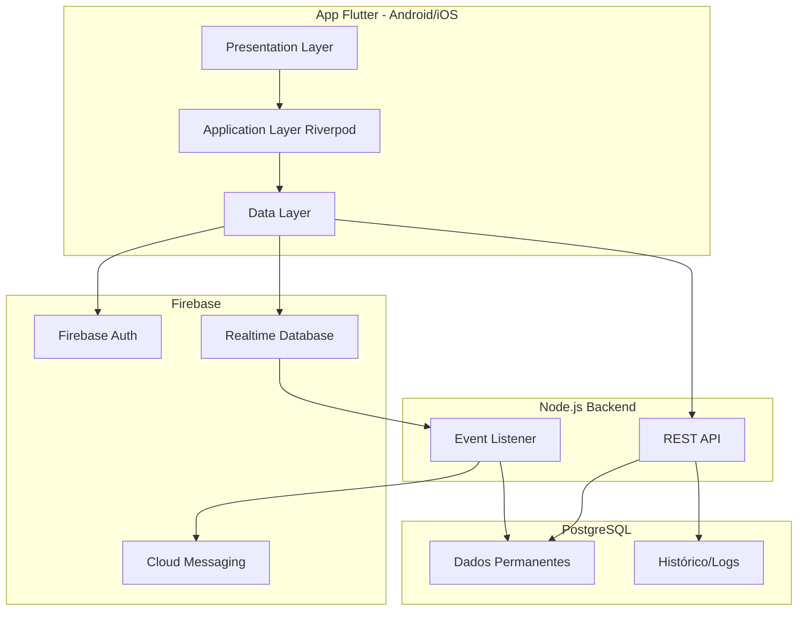
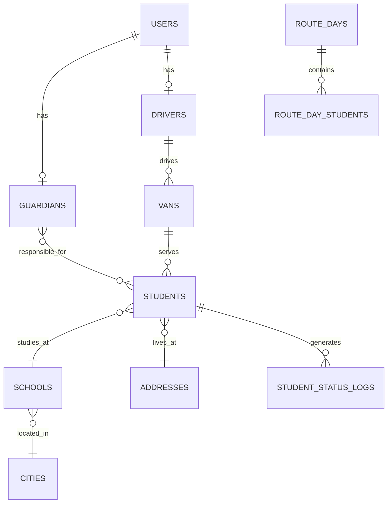

# Arquitetura e Setup Inicial - Rota Escolar

## 1. Análise dos Projetos Legados

### 1.1 Projetos Analisados
- **Van_Pro** (E:\Projetos\Van_Pro) — versão mais recente, incompleta
- **VanPro** (E:\Projetos\VanPro) — versão mais antiga, mais fiel à ideia original
- **van_pro1** e **van_pro2** — versões intermediárias

### 1.2 Assets Úteis Identificados

| Projeto | Tipo | Caminho Original | Uso Sugerido | Destino |
|---------|------|------------------|--------------|---------|
| Van_Pro | App Icons | android/app/src/main/res/mipmap-* | Ícones do app Android | assets/branding/launcher |
| Van_Pro | App Icons | ios/Runner/Assets.xcassets/AppIcon.appiconset | Ícones do app iOS | assets/branding/launcher |
| Van_Pro | Launch Images | ios/Runner/Assets.xcassets/LaunchImage.imageset | Splash screen iOS | assets/branding/splash |
| Van_Pro | SQL Schema | banco_de_dados_vanpro.sql | Referência de estrutura de dados | docs/legacy_schema.sql |

**Nota**: Não foram encontrados assets customizados (logos, ilustrações) nos projetos legados além dos ícones padrão do Flutter. Será necessário criar identidade visual nova ou importar de outra fonte.

### 1.3 Packages Legados Analisados

#### Van_Pro (versão mais recente)
**Aproveitáveis:**
- ✅ `firebase_core: ^3.13.0` — núcleo Firebase
- ✅ `firebase_auth: ^5.5.2` — autenticação
- ✅ `cloud_firestore: ^5.6.6` — Firestore (nota: vamos usar Realtime Database)
- ✅ `firebase_messaging: ^15.2.5` — push notifications
- ✅ `cached_network_image: ^3.4.1` — cache de imagens
- ✅ `url_launcher: ^6.3.1` — abrir WhatsApp/links
- ✅ `image_picker: ^1.1.2` — fotos
- ✅ `intl: ^0.20.2` — formatação
- ✅ `shared_preferences: ^2.3.4` — storage local
- ⚠️ `http: ^1.3.0` — substituir por Dio
- ⚠️ `rxdart: ^0.28.0` — não usar, Riverpod já tem streams

**Decisão**: Usar versões atuais compatíveis, trocar `http` por `dio`, não usar `rxdart`.

#### VanPro (versão antiga)
- Firebase básico (versões antigas)
- Padrão similar ao Van_Pro

#### van_pro2 (versão intermediária)
**Novos packages identificados:**
- ✅ `google_maps_flutter: ^2.10.0` — mapas (para fase futura)
- ✅ `geolocator: ^14.0.2` — GPS (para fase futura)
- ✅ `provider: ^6.1.2` — gerenciamento de estado antigo (substituir por Riverpod)

### 1.4 Insights de Funcionalidades Implementadas

#### Status de Embarque (Van_Pro/lib/core/constants/status_constants.dart)
Estados identificados:
- `aguardando` → Aguardando Van
- `embarcadoIda` → Embarcou (ida escola)
- `naEscola` → Chegou na Escola
- `aguardandoSaida` → Aguardando Saída
- `embarcadoVolta` → Embarcou (volta casa)
- `emCasa` → Chegou em Casa
- `naoVaiHoje` → Não vai hoje

**Decisão para novo app**: Simplificar para:
- `waiting_van` → aguardando van
- `to_school` → a caminho da escola
- `at_school` → na escola
- `to_home` → a caminho de casa
- `at_home` → em casa

#### Tema Visual (Van_Pro/lib/core/config/app_theme.dart)
- Material3 habilitado
- `Colors.amber` como seed color (amarelo)
- `Colors.blueGrey.shade800` para AppBar
- Cards com `borderRadius: 12`
- Botões com `borderRadius: 10`

**Decisão**: Manter paleta amarelo (#FFD700 range) + branco + preto, Material3.

#### Roles Identificados (status_constants.dart)
- `motorista`
- `responsavel`
- `admin`

**Decisão**: Manter os 3 roles, admin fica fora do app móvel na Fase 1.

#### Schema SQL Legado (banco_de_dados_vanpro.sql)
Tabelas principais:
- `usuarios` (uid Firebase, role, nome, email, telefone)
- `responsaveis` (FK usuario_id, endereço completo)
- `motoristas` (FK usuario_id, `van_code`, CPF cifrado, documentos)
- `alunos` (FK responsavel, escola, motorista, status contratação)
- `escolas` (nome, cidade, aprovação pendente/aprovada)
- `avaliacoes`, `mensalidades`, `documentos`, `fotos`, `logs`

**Decisão**: Redesenhar no PostgreSQL com estrutura similar, mas ajustada ao novo modelo de rotas do dia.

---

## 2. Arquitetura Técnica Completa

### 2.1 Visão Macro



### 2.2 Divisão de Responsabilidades

#### Firebase Realtime Database (dados voláteis)
- Status do aluno no dia
- Ordenação dinâmica da rota
- Flags: `goToday`, `talkRequested`
- Presença online do motorista
- Fila de eventos para notificações

#### PostgreSQL (dados permanentes)
- Usuários e perfis
- Alunos, responsáveis, motoristas, vans
- Escolas e cidades
- Rotas templates
- Instâncias de rotas do dia
- Logs consolidados de status
- Documentos e financeiro (fases futuras)

#### Backend Node.js
- Validar regras de negócio
- Persistir eventos críticos do Firebase → PostgreSQL
- Emitir notificações push
- Expor API REST segura
- Controlar aprovação de escolas (futuro)

### 2.3 Fluxo de Dados Principal

**Responsável marca "vai hoje":**
1. App → Firebase Realtime Database (`goToday: true`)
2. Motorista vê atualização instantânea
3. Backend listener persiste evento em PostgreSQL

**Motorista muda status do aluno:**
1. App → Firebase RTDB (`currentStatus: "to_school"`)
2. Responsável vê atualização instantânea
3. Backend cria log em `student_status_logs`
4. Backend dispara push notification via FCM

---

## 3. Estrutura de Pastas Flutter (Feature-First)

```
lib/
  app/
    app.dart                    # MaterialApp + configuração global
    bootstrap.dart              # Inicialização Firebase + providers
    router/
      app_router.dart           # GoRouter com rotas
      route_guards.dart         # Guards por autenticação/role
    theme/
      app_colors.dart           # Paleta amarelo/branco/preto
      app_theme.dart            # ThemeData Material3
      app_typography.dart       # TextStyles
    core/
      constants/
        status_constants.dart   # Enums de status, período, role
        api_constants.dart      # Base URLs backend
      enums/
      errors/
        app_exception.dart
      extensions/
        datetime_extensions.dart
        string_extensions.dart
      utils/
        validators.dart
        formatters.dart
      widgets/
        app_button.dart
        app_card.dart
        status_chip.dart
        loading_indicator.dart
      services/
        connectivity_service.dart
        logger_service.dart
  
  shared/
    models/
      user_session.dart         # Sessão global
    providers/
      session_provider.dart     # Riverpod provider sessão
    widgets/
      error_view.dart
      empty_state.dart
    formatters/
  
  features/
    auth/
      domain/
        models/
          auth_user.dart
        repositories/
          auth_repository.dart
      application/
        auth_service.dart
        auth_state_provider.dart
      data/
        firebase_auth_repository.dart
      presentation/
        pages/
          login_page.dart
          register_page.dart
        widgets/
          login_form.dart
    
    onboarding/
      presentation/
        pages/
          role_selection_page.dart
          welcome_page.dart
    
    guardian_home/
      domain/
        models/
          student_summary.dart
      application/
        guardian_home_provider.dart
      data/
        guardian_repository.dart
      presentation/
        pages/
          guardian_home_page.dart
        widgets/
          student_card.dart
          status_timeline.dart
    
    driver_home/
      domain/
        models/
          route_day.dart
          student_in_route.dart
      application/
        driver_home_provider.dart
        route_reorder_provider.dart
      data/
        driver_repository.dart
      presentation/
        pages/
          driver_home_page.dart
        widgets/
          student_list_item.dart
          reorderable_route_list.dart
          status_action_buttons.dart
    
    students/
      domain/
        models/
          student.dart
          address.dart
      application/
        student_form_provider.dart
      data/
        student_repository.dart
        viacep_service.dart
      presentation/
        pages/
          student_registration_page.dart
        widgets/
          address_form.dart
          school_selector.dart
    
    routes/
      domain/
        models/
          route_template.dart
      application/
        route_provider.dart
      data/
        route_repository.dart
      presentation/
        pages/
          routes_management_page.dart
    
    realtime_status/
      domain/
        models/
          realtime_student_status.dart
      application/
        realtime_sync_provider.dart
      data/
        firebase_realtime_repository.dart
    
    chat_flags/
      domain/
        models/
          talk_request.dart
      application/
        talk_request_provider.dart
      data/
        talk_request_repository.dart
      presentation/
        widgets/
          talk_request_badge.dart
    
    profile/
      domain/
        models/
          user_profile.dart
      application/
        profile_provider.dart
      data/
        profile_repository.dart
      presentation/
        pages/
          profile_page.dart
    
    notifications/
      domain/
        models/
          app_notification.dart
      application/
        notification_service.dart
      data/
        fcm_repository.dart
  
  l10n/
    app_pt.arb
    app_en.arb
  
  main.dart                     # Entry point
```

---

## 4. Firebase Realtime Database Schema

```json
{
  "vans": {
    "{vanId}": {
      "activeRouteDayId": "route_day_123",
      "driverId": "uid_driver_1",
      "status": "online",
      "updatedAt": 1710000000
    }
  },
  
  "routeDays": {
    "{routeDayId}": {
      "vanId": "van_1",
      "period": "morning_outbound",
      "date": "2026-05-12",
      "driverId": "uid_driver_1",
      "studentOrder": {
        "student_1": 1,
        "student_2": 2,
        "student_3": 3
      },
      "students": {
        "student_1": {
          "status": "waiting_van",
          "goToday": true,
          "talkRequested": false,
          "lastStatusAt": 1710000000,
          "lastUpdatedBy": "uid_driver_1"
        },
        "student_2": {
          "status": "to_school",
          "goToday": true,
          "talkRequested": false,
          "lastStatusAt": 1710000100,
          "lastUpdatedBy": "uid_driver_1"
        }
      }
    }
  },
  
  "studentsRealtime": {
    "{studentId}": {
      "currentRouteDayId": "route_day_123",
      "currentStatus": "to_school",
      "goToday": true,
      "talkRequested": false,
      "guardianIds": {
        "uid_guardian_1": true
      },
      "driverId": "uid_driver_1",
      "vanId": "van_1",
      "updatedAt": 1710000100
    }
  },
  
  "talkRequests": {
    "{driverId}": {
      "{studentId}": {
        "guardianId": "uid_guardian_1",
        "messageType": "talk_request",
        "status": "pending",
        "createdAt": 1710000000,
        "ackAt": null
      }
    }
  },
  
  "presence": {
    "drivers": {
      "{driverId}": {
        "online": true,
        "lastSeenAt": 1710000000
      }
    }
  },
  
  "notificationsQueue": {
    "{eventId}": {
      "type": "student_status_changed",
      "targetUserIds": {
        "uid_guardian_1": true
      },
      "payload": {
        "studentId": "student_1",
        "status": "at_school"
      },
      "createdAt": 1710000000,
      "processed": false
    }
  }
}
```

### Convenções de Status
- `waiting_van` — aguardando van
- `to_school` — a caminho da escola
- `at_school` — na escola
- `to_home` — a caminho de casa
- `at_home` — em casa

### Períodos de Rota
- `morning_outbound` — manhã ida escola
- `morning_return` — manhã volta casa
- `afternoon_outbound` — tarde ida escola
- `afternoon_return` — tarde volta casa

---

## 5. PostgreSQL Schema Inicial

```sql
-- USERS
CREATE TABLE users (
  id UUID PRIMARY KEY DEFAULT gen_random_uuid(),
  firebase_uid VARCHAR(128) NOT NULL UNIQUE,
  role VARCHAR(20) CHECK (role IN ('guardian', 'driver', 'admin')),
  full_name VARCHAR(120) NOT NULL,
  phone VARCHAR(20) NOT NULL,
  email VARCHAR(160) NOT NULL UNIQUE,
  whatsapp_phone VARCHAR(20),
  is_active BOOLEAN DEFAULT true,
  created_at TIMESTAMPTZ DEFAULT NOW(),
  updated_at TIMESTAMPTZ DEFAULT NOW()
);

CREATE INDEX idx_users_firebase_uid ON users(firebase_uid);
CREATE INDEX idx_users_role ON users(role);

-- GUARDIANS
CREATE TABLE guardians (
  id UUID PRIMARY KEY DEFAULT gen_random_uuid(),
  user_id UUID NOT NULL REFERENCES users(id) ON DELETE CASCADE,
  cpf VARCHAR(255), -- cifrado AES-256 no futuro
  primary_address_id UUID
);

-- DRIVERS
CREATE TABLE drivers (
  id UUID PRIMARY KEY DEFAULT gen_random_uuid(),
  user_id UUID NOT NULL REFERENCES users(id) ON DELETE CASCADE,
  cnh_number VARCHAR(50),
  photo_url VARCHAR(500),
  status VARCHAR(20) DEFAULT 'active' CHECK (status IN ('active', 'inactive'))
);

-- VANS
CREATE TABLE vans (
  id UUID PRIMARY KEY DEFAULT gen_random_uuid(),
  code VARCHAR(10) NOT NULL UNIQUE, -- VanCode
  display_name VARCHAR(100) NOT NULL,
  plate VARCHAR(10),
  capacity INT DEFAULT 0,
  driver_id UUID REFERENCES drivers(id),
  is_active BOOLEAN DEFAULT true
);

-- CITIES
CREATE TABLE cities (
  id UUID PRIMARY KEY DEFAULT gen_random_uuid(),
  name VARCHAR(100) NOT NULL,
  state_code CHAR(2) NOT NULL,
  ibge_code VARCHAR(10)
);

CREATE UNIQUE INDEX idx_cities_name_state ON cities(name, state_code);

-- ADDRESSES
CREATE TABLE addresses (
  id UUID PRIMARY KEY DEFAULT gen_random_uuid(),
  zip_code VARCHAR(9) NOT NULL,
  street VARCHAR(255) NOT NULL,
  number VARCHAR(10),
  complement VARCHAR(100),
  district VARCHAR(100),
  city_id UUID NOT NULL REFERENCES cities(id),
  latitude DECIMAL(10, 8),
  longitude DECIMAL(11, 8),
  source VARCHAR(20) DEFAULT 'viacep' CHECK (source IN ('viacep', 'manual', 'geocoded'))
);

-- SCHOOLS
CREATE TABLE schools (
  id UUID PRIMARY KEY DEFAULT gen_random_uuid(),
  name VARCHAR(200) NOT NULL,
  city_id UUID NOT NULL REFERENCES cities(id),
  address_id UUID REFERENCES addresses(id),
  approval_status VARCHAR(20) DEFAULT 'pending' CHECK (approval_status IN ('pending', 'approved', 'rejected')),
  created_by_user_id UUID REFERENCES users(id),
  approved_by_user_id UUID REFERENCES users(id),
  created_at TIMESTAMPTZ DEFAULT NOW(),
  updated_at TIMESTAMPTZ DEFAULT NOW()
);

CREATE INDEX idx_schools_city_id ON schools(city_id);
CREATE INDEX idx_schools_approval_status ON schools(approval_status);

-- STUDENTS
CREATE TABLE students (
  id UUID PRIMARY KEY DEFAULT gen_random_uuid(),
  full_name VARCHAR(120) NOT NULL,
  birth_date DATE,
  photo_url VARCHAR(500),
  notes TEXT,
  school_id UUID NOT NULL REFERENCES schools(id),
  home_address_id UUID NOT NULL REFERENCES addresses(id),
  van_id UUID REFERENCES vans(id),
  created_at TIMESTAMPTZ DEFAULT NOW(),
  updated_at TIMESTAMPTZ DEFAULT NOW()
);

CREATE INDEX idx_students_van_id ON students(van_id);
CREATE INDEX idx_students_school_id ON students(school_id);

-- GUARDIAN_STUDENTS (muitos para muitos)
CREATE TABLE guardian_students (
  guardian_id UUID NOT NULL REFERENCES guardians(id) ON DELETE CASCADE,
  student_id UUID NOT NULL REFERENCES students(id) ON DELETE CASCADE,
  relationship_type VARCHAR(50) DEFAULT 'parent',
  PRIMARY KEY (guardian_id, student_id)
);

-- ROUTE TEMPLATES
CREATE TABLE route_templates (
  id UUID PRIMARY KEY DEFAULT gen_random_uuid(),
  van_id UUID NOT NULL REFERENCES vans(id),
  period VARCHAR(30) NOT NULL CHECK (period IN ('morning_outbound', 'morning_return', 'afternoon_outbound', 'afternoon_return')),
  name VARCHAR(100),
  is_active BOOLEAN DEFAULT true
);

CREATE INDEX idx_route_templates_van_id ON route_templates(van_id);

-- ROUTE TEMPLATE STOPS
CREATE TABLE route_template_stops (
  id UUID PRIMARY KEY DEFAULT gen_random_uuid(),
  route_template_id UUID NOT NULL REFERENCES route_templates(id) ON DELETE CASCADE,
  student_id UUID NOT NULL REFERENCES students(id),
  stop_order INT NOT NULL
);

-- ROUTE DAYS (instância do dia)
CREATE TABLE route_days (
  id UUID PRIMARY KEY DEFAULT gen_random_uuid(),
  route_template_id UUID REFERENCES route_templates(id),
  van_id UUID NOT NULL REFERENCES vans(id),
  driver_id UUID NOT NULL REFERENCES drivers(id),
  period VARCHAR(30) NOT NULL CHECK (period IN ('morning_outbound', 'morning_return', 'afternoon_outbound', 'afternoon_return')),
  service_date DATE NOT NULL,
  status VARCHAR(20) DEFAULT 'planned' CHECK (status IN ('planned', 'in_progress', 'completed', 'cancelled')),
  created_at TIMESTAMPTZ DEFAULT NOW()
);

CREATE INDEX idx_route_days_van_date_period ON route_days(van_id, service_date, period);

-- ROUTE DAY STUDENTS
CREATE TABLE route_day_students (
  id UUID PRIMARY KEY DEFAULT gen_random_uuid(),
  route_day_id UUID NOT NULL REFERENCES route_days(id) ON DELETE CASCADE,
  student_id UUID NOT NULL REFERENCES students(id),
  stop_order INT NOT NULL,
  go_today BOOLEAN DEFAULT true,
  current_status VARCHAR(30),
  talk_requested BOOLEAN DEFAULT false,
  last_status_at TIMESTAMPTZ
);

CREATE INDEX idx_route_day_students_route_day_id ON route_day_students(route_day_id);

-- STUDENT STATUS LOGS
CREATE TABLE student_status_logs (
  id UUID PRIMARY KEY DEFAULT gen_random_uuid(),
  student_id UUID NOT NULL REFERENCES students(id),
  route_day_id UUID REFERENCES route_days(id),
  from_status VARCHAR(30),
  to_status VARCHAR(30) NOT NULL,
  changed_by_user_id UUID REFERENCES users(id),
  source VARCHAR(20) DEFAULT 'driver_app' CHECK (source IN ('driver_app', 'guardian_app', 'system')),
  created_at TIMESTAMPTZ DEFAULT NOW()
);

CREATE INDEX idx_student_status_logs_student_id ON student_status_logs(student_id);
CREATE INDEX idx_student_status_logs_route_day_id ON student_status_logs(route_day_id);

-- TALK REQUESTS
CREATE TABLE talk_requests (
  id UUID PRIMARY KEY DEFAULT gen_random_uuid(),
  student_id UUID NOT NULL REFERENCES students(id),
  guardian_id UUID NOT NULL REFERENCES guardians(id),
  driver_id UUID NOT NULL REFERENCES drivers(id),
  route_day_id UUID REFERENCES route_days(id),
  status VARCHAR(20) DEFAULT 'pending' CHECK (status IN ('pending', 'acknowledged', 'resolved')),
  created_at TIMESTAMPTZ DEFAULT NOW(),
  acknowledged_at TIMESTAMPTZ,
  resolved_at TIMESTAMPTZ
);

CREATE INDEX idx_talk_requests_driver_id_status ON talk_requests(driver_id, status);
```

### Relacionamentos ER Diagram



---

## 6. Packages Recomendados

### Core Dependencies
```yaml
dependencies:
  flutter:
    sdk: flutter
  
  # State Management
  flutter_riverpod: ^2.6.1
  riverpod_annotation: ^2.6.1
  
  # Routing
  go_router: ^15.0.0
  
  # Code Generation
  freezed_annotation: ^2.4.4
  json_annotation: ^4.9.0
  
  # Firebase
  firebase_core: ^3.13.0
  firebase_auth: ^5.5.2
  firebase_database: ^11.5.1  # Realtime Database
  firebase_messaging: ^15.2.5
  
  # HTTP & API
  dio: ^5.9.0
  
  # Utilities
  intl: ^0.20.2
  uuid: ^4.5.1
  
  # Storage
  shared_preferences: ^2.3.4
  flutter_secure_storage: ^9.2.3
  
  # UI
  cached_network_image: ^3.4.1
  flutter_svg: ^2.0.15
  google_fonts: ^6.2.1
  url_launcher: ^6.3.1
  
  # Connectivity
  connectivity_plus: ^6.1.2
  
  # Future: Maps & Location
  # geolocator: ^14.0.2
  # geocoding: ^3.0.2

dev_dependencies:
  flutter_test:
    sdk: flutter
  
  # Linting
  flutter_lints: ^5.0.0
  custom_lint: ^0.7.2
  riverpod_lint: ^2.6.2
  
  # Code Generation
  build_runner: ^2.4.14
  freezed: ^2.5.7
  json_serializable: ^6.9.2
  riverpod_generator: ^2.6.2
```

### Justificativas de Escolha
- **Riverpod**: gerenciamento de estado composicional, testável, alinhado com app novo
- **GoRouter**: navegação declarativa com guards por role
- **Dio**: interceptors, timeout, retry, escalabilidade
- **Freezed**: imutabilidade, copyWith, pattern matching
- **Firebase Realtime Database**: sincronização bidirecional em tempo real
- **flutter_secure_storage**: tokens/secrets sensíveis

### Packages a Evitar (Fase 1)
- ❌ `bloc`/`cubit` — já temos Riverpod
- ❌ `provider` — substituído por Riverpod
- ❌ `rxdart` — Riverpod já tem streams
- ❌ `http` — substituir por Dio
- ❌ Geradores de formulário muito opinionados

---

## 7. Roadmap da Fase 1 com Subtarefas Ordenadas

### Etapa 1 — Fundação do Repositório ✅
- [x] Criar app Flutter
- [ ] Configurar estrutura feature-first
- [ ] Adicionar dependências base ao pubspec.yaml
- [ ] Configurar tema base amarelo/branco/preto
- [ ] Definir assets placeholders

### Etapa 2 — Infra de Autenticação e Bootstrap
- [ ] Integrar Firebase Core/Auth
- [ ] Criar `auth` feature completa
- [ ] Modelar sessão do usuário (Riverpod)
- [ ] Criar fluxo de login/cadastro
- [ ] Configurar custom claims/role
- [ ] Redirecionar para home correta por `guardian`/`driver`

### Etapa 3 — Cadastros Permanentes
- [ ] Definir API Node.js inicial
- [ ] Modelar PostgreSQL com migrations
- [ ] Implementar feature `students` (cadastro aluno)
- [ ] Integrar ViaCEP para busca de endereço
- [ ] Criar seletor de escolas aprovadas por cidade
- [ ] Vincular aluno via `vanCode`

### Etapa 4 — Tempo Real do Dia
- [ ] Criar nós Firebase Realtime Database
- [ ] Implementar feature `realtime_status`
- [ ] Sincronizar `goToday` (responsável → motorista)
- [ ] Sincronizar `talkRequested` (responsável → motorista)
- [ ] Sincronizar `currentStatus` (motorista → responsável)
- [ ] Montar listeners Riverpod
- [ ] Refletir atualizações nas homes

### Etapa 5 — Home Responsável
- [ ] Implementar feature `guardian_home`
- [ ] Cards por aluno com status atual
- [ ] Timeline de status e último update
- [ ] Ação `vai/não vai hoje`
- [ ] Ação `quero falar`
- [ ] Acesso ao histórico de status
- [ ] Botão WhatsApp para motorista

### Etapa 6 — Home Motorista
- [ ] Implementar feature `driver_home`
- [ ] Lista do dia por período (rota ativa)
- [ ] Reorder drag-and-drop de alunos
- [ ] Botões de troca de status por aluno
- [ ] Indicadores visuais `vaiHoje`
- [ ] Fila de `quero falar` pendentes
- [ ] Bloqueios visuais para segurança operacional

### Etapa 7 — Logs, Notificações e Robustez
- [ ] Persistir logs de status no PostgreSQL
- [ ] Disparar notificações push relevantes (FCM)
- [ ] Ack de `quero falar` pelo motorista
- [ ] Tratamento offline/retentativa básico
- [ ] Observabilidade mínima de erros

### Etapa 8 — Validação Funcional
- [ ] Smoke tests de autenticação
- [ ] Smoke tests de sincronização em tempo real
- [ ] Validação de Firebase Security Rules
- [ ] Validação de rotas por role (GoRouter guards)
- [ ] Validação de cadastro aluno + CEP + van

---

## 8. Setup Inicial do Projeto Flutter

### 8.1 Criar Projeto ✅
```powershell
cd E:\Projetos\rota_escolar
flutter create --org com.rotaescolar --project-name rota_escolar .
```

### 8.2 Configurar pubspec.yaml
Ver seção 6 (Packages Recomendados).

### 8.3 Configurar Firebase
1. Criar projeto Firebase no console
2. Registrar app Android (`com.rotaescolar.rota_escolar`)
3. Registrar app iOS (`com.rotaescolar.rotaEscolar`)
4. Baixar `google-services.json` e `GoogleService-Info.plist`
5. Habilitar Authentication (Email/Password)
6. Habilitar Realtime Database
7. Configurar Security Rules básicas
8. Habilitar Cloud Messaging (FCM)
9. Configurar custom claims para `role`

### 8.4 Preparar Backend Node.js
Estrutura sugerida:
```
backend/
  src/
    modules/
      auth/
      users/
      students/
      schools/
      routes/
      realtime-sync/
    infra/
      db/
        migrations/
      firebase/
      http/
  package.json
  tsconfig.json
```

### 8.5 Preparar PostgreSQL
- Criar database `rota_escolar_dev`
- Executar migrations iniciais (schema seção 5)
- Seeds mínimas:
  - 5-10 cidades base
  - 3-5 escolas aprovadas
  - 1 van de teste com `vanCode` conhecido

### 8.6 Base Visual
Paleta de cores:
```dart
// app/theme/app_colors.dart
class AppColors {
  // Amarelo van escolar
  static const primary = Color(0xFFFFD700); // gold
  static const primaryDark = Color(0xFFFFB300); // amber-700
  static const primaryLight = Color(0xFFFFE57F); // amber-200
  
  // Preto
  static const text = Color(0xFF212121);
  static const textSecondary = Color(0xFF757575);
  
  // Branco
  static const background = Color(0xFFFFFFFF);
  static const surface = Color(0xFFFAFAFA);
  
  // Status
  static const success = Color(0xFF4CAF50);
  static const warning = Color(0xFFFF9800);
  static const error = Color(0xFFF44336);
  static const info = Color(0xFF2196F3);
}
```

Componentes base a criar:
- `AppButton` (primário, secundário, text)
- `StatusChip` (por status do aluno)
- `StudentCard` (responsável)
- `StudentListItem` (motorista)
- `SectionHeader`
- `RoleBottomNav` (navegação inferior diferente por role)

### 8.7 Base de Assets
Criar convenção:
```
assets/
  branding/
    launcher/    # ícones copiados do Van_Pro
    splash/      # splash screens
  icons/
    custom/      # ícones SVG customizados
  images/
    empty_states/
    illustrations/
```

---

## 9. Fluxos-Chave do MVP

### Fluxo 1 — Login e Roteamento
1. Usuário autentica via Firebase Auth (email/password)
2. App lê custom claims/role do token
3. App consulta perfil básico no backend
4. GoRouter redireciona:
   - `guardian` → `GuardianHomePage`
   - `driver` → `DriverHomePage`
   - `admin` → (fora do escopo MVP)

### Fluxo 2 — Responsável Marca "Vai Hoje"
1. Responsável abre `StudentCard` do filho
2. Alterna switch `goToday`
3. Update vai para Firebase RTDB `/studentsRealtime/{studentId}/goToday`
4. Home do motorista reflete mudança instantânea
5. Backend listener registra evento se necessário

### Fluxo 3 — Motorista Altera Status do Aluno
1. Motorista toca botão do próximo status na lista
2. Update vai para Firebase RTDB:
   - `/studentsRealtime/{studentId}/currentStatus`
   - `/routeDays/{routeDayId}/students/{studentId}/status`
3. Responsável vê atualização instantânea no `StudentCard`
4. Backend persiste em `student_status_logs`
5. Backend dispara push notification para responsável

### Fluxo 4 — "Quero Falar"
1. Responsável sinaliza `talkRequested: true`
2. Flag entra em Firebase RTDB `/talkRequests/{driverId}/{studentId}`
3. Home do motorista mostra badge/alerta
4. Motorista visualiza quando seguro (parado)
5. Motorista toca "reconhecer" → `ackAt: timestamp`
6. Backend mantém histórico em `talk_requests`

---

## 10. Riscos e Mitigações

| Risco | Impacto | Mitigação |
|-------|---------|-----------|
| Duplicidade de fonte (Firebase vs PostgreSQL) | Alto | Definir claramente **source of truth por tipo de dado**: volátil no Firebase, permanente no PostgreSQL |
| Complexidade de autorização por role + vínculo aluno/van | Médio | Usar Security Rules Firebase + JWT verificado no backend |
| Sincronização de reorder de rota em tempo real | Médio | Usar campo `studentOrder` com números sequenciais, atualizar atomicamente |
| Diferença entre dados do dia e cadastro permanente | Médio | Manter backend como consolidador de histórico, versionar eventos críticos |
| Conflito de updates simultâneos | Baixo | Firebase RTDB tem last-write-wins; adicionar `lastUpdatedBy` e `updatedAt` |

---

## 11. Definition of Done (DoD)

### Documento de Arquitetura ✅
- [x] `docs/architecture-plan.md` criado

### Inventário de Projetos Antigos ✅
- [x] Assets úteis catalogados
- [x] Packages legados analisados
- [x] Insights de funcionalidades documentados

### Estrutura Flutter ⏳
- [x] Projeto Flutter criado
- [ ] Estrutura feature-first implementada
- [ ] Dependências base configuradas

### Schemas 🔜
- [ ] Schema Realtime Database documentado e implementado
- [ ] Schema PostgreSQL documentado e migrations criadas

### Roadmap 🔜
- [ ] Sequência de implementação da Fase 1 definida ✅
- [ ] Checklist de setup inicial documentado ✅

---

## 12. Próximos Passos Imediatos

1. ✅ Documento de arquitetura criado
2. 🔄 Configurar `pubspec.yaml` com dependências
3. 🔄 Criar estrutura feature-first de pastas
4. 🔜 Configurar Firebase (projeto + apps Android/iOS)
5. 🔜 Implementar tema base e componentes core
6. 🔜 Iniciar feature `auth`
7. 🔜 Preparar backend Node.js básico
8. 🔜 Criar migrations PostgreSQL

---

**Última atualização**: 2026-05-12  
**Versão do documento**: 1.0  
**Status**: Base de arquitetura aprovada e documentada
